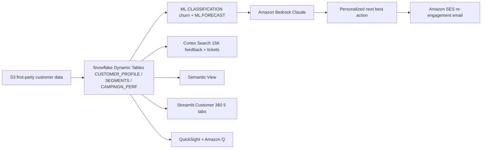

# Customer 360 & Loyalty Hub

End-to-end customer intelligence across 12 APJ markets — Snowflake ML detects churn, Amazon Bedrock writes personalized re-engagement offers, Amazon SES delivers the email, and QuickSight powers executive dashboards.

## Architecture

A customer intelligence hub built on **Snowflake** (Dynamic Tables, ML.CLASSIFICATION, ML.FORECAST, Cortex Search, semantic view, Cortex Analyst) and **AWS** (S3, Bedrock Claude Sonnet, SES, QuickSight + Amazon Q). Snowflake ML detects churn; Bedrock writes the next-best-action offer; SES delivers the email; QuickSight serves the executives.



## Snowflake Capabilities

| Capability | Implementation |
|-----------|---------------|
| Dynamic Tables | CUSTOMER_PROFILE / SEGMENTS / CAMPAIGN_PERFORMANCE |
| ML Functions | ML.CLASSIFICATION (churn detection) + ML.FORECAST (revenue) |
| Cortex Search | 15,000 feedback + support ticket documents indexed |
| Cortex Agent | CustomerAnalyst + FeedbackSearch tools |
| Semantic View | Structured analytics over customers, segments, campaigns |
| Streamlit | 5-tab Customer 360 dashboard |

## AWS Services

| Service | Role in Demo |
|---------|-------------|
| Amazon S3 | First-party customer data landing zone |
| Amazon Bedrock | Claude-powered next-best-action generation |
| Amazon SES | Automated re-engagement email delivery |
| Amazon QuickSight | Executive customer intelligence dashboard |
| Amazon Q | Natural language analytics for CMO |

## Personas

| Persona | Role | Key Questions |
|---------|------|---------------|
| **Marketing Analyst** | CRM & loyalty team lead | "Which customers are at risk of churning?" "What's the best re-engagement offer for this segment?" |
| **CMO** | Chief Marketing Officer | "What's our CLV by segment and country?" "How are campaigns performing?" |

## Data

| Table | Rows | Description |
|-------|------|-------------|
| CUSTOMERS | 5,000 | APJ customers across 12 countries, Gold/Silver/Bronze tiers |
| TRANSACTIONS | 100,000 | Purchase history: In-Store, Online, Mobile, Marketplace |
| LOYALTY_EVENTS | 50,000 | Points earn/redeem/expire events |
| CUSTOMER_FEEDBACK | 10,000 | Reviews with ratings and feedback text |
| SUPPORT_TICKETS | 5,000 | Support cases with descriptions and resolutions |
| CAMPAIGNS | 200 | Marketing campaigns (Email, Push, SMS, In-App, Social) |
| CAMPAIGN_RESPONSES | 20,000 | Open/click/convert/unsubscribe events |

## Build Instructions

### Prerequisites
- Snowflake account with ACCOUNTADMIN access
- Cortex AI enabled (ML Functions, Search, Agent)
- Warehouse: CORTEX (Medium)
- AWS CLI with Bedrock, SES, QuickSight access (us-west-2)

### Deployment

```bash
snowsql -f snowflake/00_setup.sql
snowsql -f snowflake/01_integrations.sql
snowsql -f snowflake/02_raw_tables.sql
snowsql -f snowflake/03_curated.sql
snowsql -f snowflake/04_search.sql
snowsql -f snowflake/05_ml.sql
snowsql -f snowflake/06_semantic.sql
snowsql -f snowflake/07_agent.sql
```

### Streamlit App
```
RETAIL_CUSTOMER_360.APP.CUSTOMER_360_APP
```

## Build Modes

### Snowflake Only
Run the SQL scripts in `snowflake/` (skip `01_integrations.sql`) and deploy the Streamlit app from `streamlit/deploy/`. Uses Cortex AI instead of Bedrock, and Snowflake Intelligence instead of QuickSight.

### Full AWS + Snowflake
Run all SQL scripts including `01_integrations.sql`, deploy the main Streamlit app from `streamlit/`, then run the QuickSight setup from `quicksight/`.

## Key Demo Numbers

- **284 customers** at risk of churning (ML CLASSIFICATION)
- **5,000 unified profiles** across 12 APJ markets
- **15,000 documents** indexed for semantic search (feedback + tickets)
- **Detect → Personalize → Deliver** loop: Snowflake ML → Bedrock NBA → SES email

## License

Apache 2.0 — See [LICENSE](LICENSE) for details.
